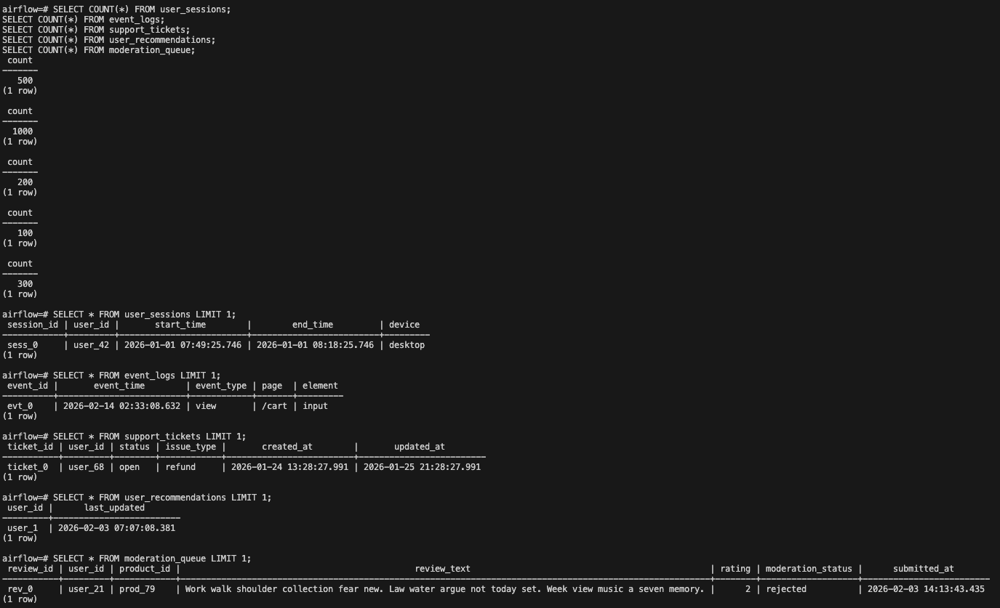
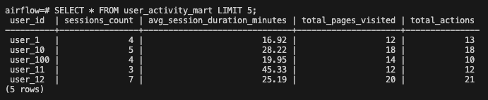
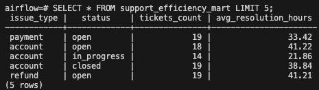
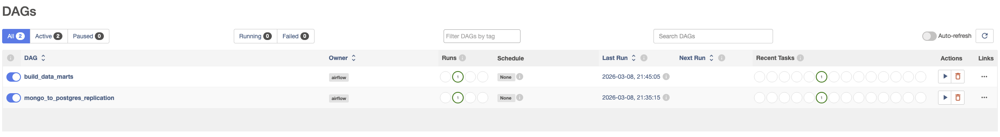

# Итоговое задание по модулю 3 — ETL-процесс

## Структура проекта
- `airflow/dags/` — DAG-файлы и Python-скрипты для Airflow
- `jupyter/notebooks/` — скрипты генерации данных и локальной проверки
- `init/` — SQL-скрипты для создания таблиц PostgreSQL
- `docker-compose.yml` — описание контейнеров

## 1 Генерация данных в MongoDB
В MongoDB были созданы и заполнены данными следующие коллекции:
- `UserSessions`
- `EventLogs`
- `SupportTickets`
- `UserRecommendations`
- `ModerationQueue`

Для генерации данных использовался скрипт `generate_mongo_data.py`.

## 2 Репликация данных MongoDB → PostgreSQL

Для репликации данных был реализован скрипт `mongo_to_postgres.py`.

Скрипт выполняет:
- извлечение данных из MongoDB
- трансформацию вложенных структур
- загрузку данных в реляционные таблицы PostgreSQL

В PostgreSQL были созданы следующие таблицы:

- `user_sessions`
- `session_pages`
- `session_actions`
- `event_logs`
- `support_tickets`
- `support_ticket_messages`
- `user_recommendations`
- `recommended_products`
- `moderation_queue`
- `moderation_flags`

### Проверка загрузки данных в PostgreSQL

После выполнения ETL-скрипта данные были успешно перенесены из MongoDB в PostgreSQL.

## 3 Построение аналитических витрин

На основе данных PostgreSQL были реализованы две аналитические витрины.

### Витрина 1 — Активность пользователей

Таблица: `user_activity_mart`

Витрина содержит агрегированные показатели активности пользователей:

- количество пользовательских сессий
- среднюю длительность сессии
- количество посещённых страниц
- количество действий пользователей

Источник данных:
- `user_sessions`
- `session_pages`
- `session_actions`

### Витрина 2 — Эффективность работы поддержки

Таблица: `support_efficiency_mart`

Витрина содержит агрегированную статистику по обращениям пользователей:

- количество тикетов по типам проблем
- статус обращений
- среднее время решения обращения

Источник данных:
- `support_tickets`

## 4 Использование Apache Airflow

Для автоматизации ETL-процесса использовался Apache Airflow.

Были реализованы два DAG:

- `mongo_to_postgres_replication` — репликация данных из MongoDB в PostgreSQL
- `build_data_marts` — построение аналитических витрин

Пайплайны выполняют скрипты:

- `mongo_to_postgres.py`
- `build_marts.py`

