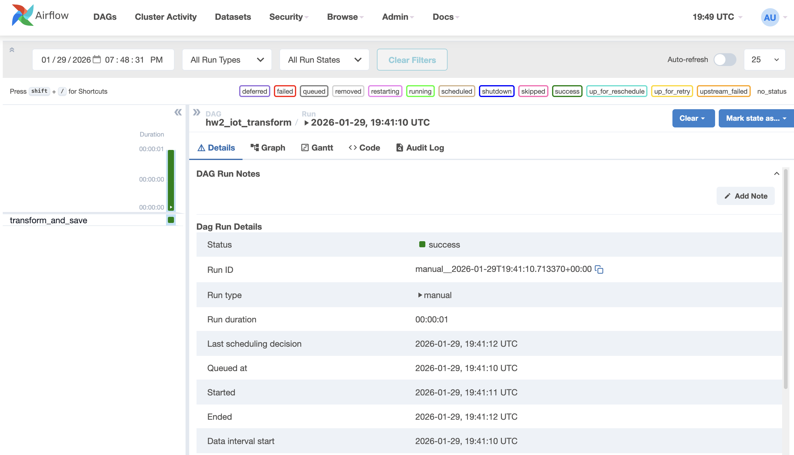

1.	получили очищенные данные в файле: iot_temp_clean.csv
2.	получили дневную агрегацию в файле: iot_temp_daily.csv
3.	получили 5 самых холодных дней в файле: top5_coldest_days.csv
4.	получили 5 самых жарких дней в файле: top5_hottest_days.csv

Успешно выполненный dag в airflow:
