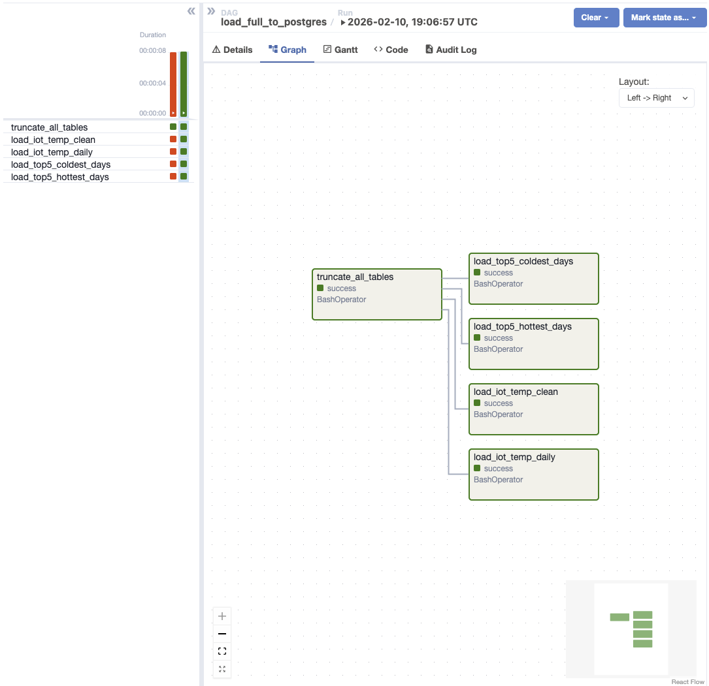
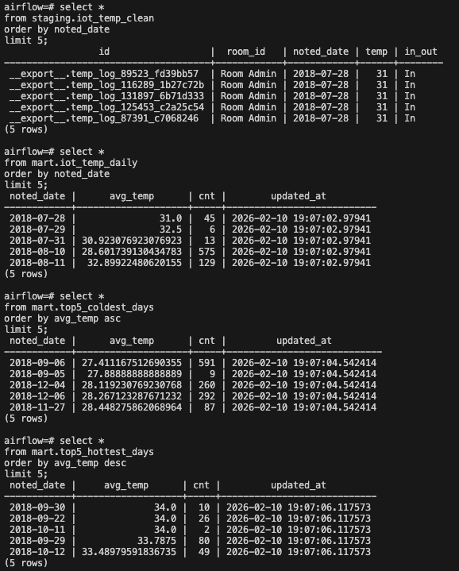
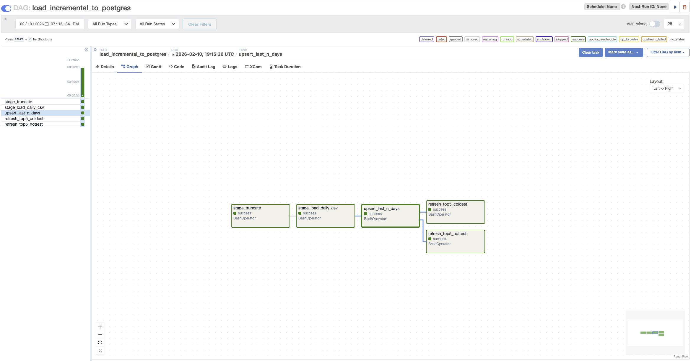
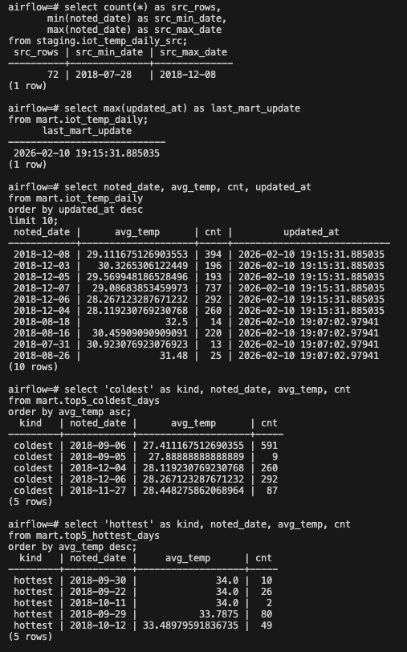

## Результаты выполнения

### Full load DAG
**Скрин с успешным выполнением DAG `load_full_to_postgres`, на нём видно зелёный статус всех задач:**

---

### Проверка данных после full load
**Скрин с выполненными SELECT запросами в Postgres, на нём видно:**
- загруженные строки в `staging.iot_temp_clean`;
- агрегированные данные в `mart.iot_temp_daily`;
- заполненные витрины `mart.top5_coldest_days` и `mart.top5_hottest_days`.

---

### Incremental load DAG
**Скрин с успешным выполнением DAG `load_incremental_to_postgres`, на нём видно зелёный статус всех задач:**

---

### Проверка данных после incremental load
**Скрин с выполненными SELECT запросами в Postgres, на нём видно:**
- заполненную staging-таблицу `staging.iot_temp_daily_src`;
- обновлённые строки в `mart.iot_temp_daily` по полю `updated_at`;
- актуальные top-5 витрины холодных и жарких дней.

