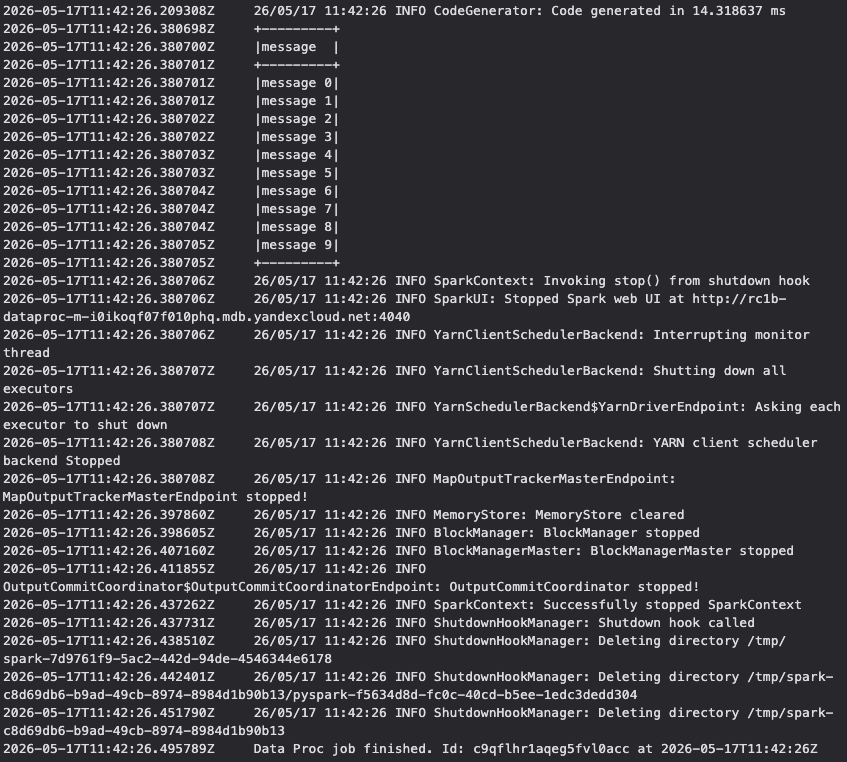

## Проверка результата

PySpark-задание (`spark_consumer.py`) прочитало 10 сообщений из топика `test-topic` кластера Yandex Managed Kafka.  
На скриншоте видны таблица с сообщениями `message 0` — `message 9` и строка `Data Proc job finished`, подтверждающая успешное завершение задания.